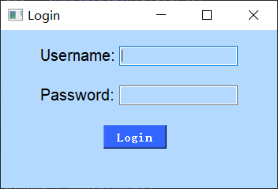
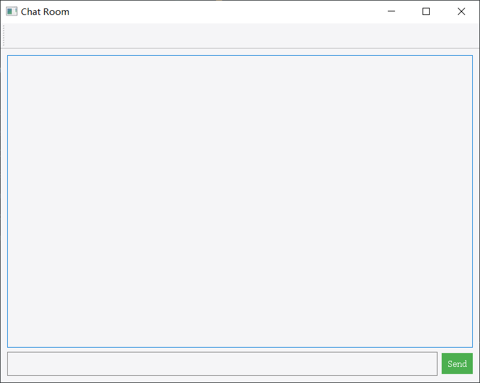

## 整体结构
项目采用 c/s 模式设计  
服务端主要负责接收来自客户端的消息，并将其转发出去，每一个客户端对应一个线程 
客户端主要构建图形化界面，对用户发出的消息做格式化，以便服务端处理 
## 功能（暂定）
1. 能够提供基本的收发消息的功能
2. 显示在线的用户

## 服务端
使用`select`提升多路转接效率，基于生产消费者模型将任务提交到后端线程池处理 
当有客户端的消息到来时，调用`productor`函数对消息做处理后放到任务队列中，
### 定制应用层协议
length + ":;" + data   `e.g: 5:;hello`  
使用json完成序列化和反序列化

## 客户端
- 登录界面
- 聊天界面
> 登录界面和聊天界面基于PyQt5构建，界面分别如下示：
> 

### 客户端client设计
- 发送缓冲区和接收缓冲区：分别存放将要发送给服务器和从服务器中获得的数据，所有执行流共享
- 设计一个recv函数来接收服务器的数据并将其放入recvBuffer中
- 为发送和接收缓冲区加两把锁