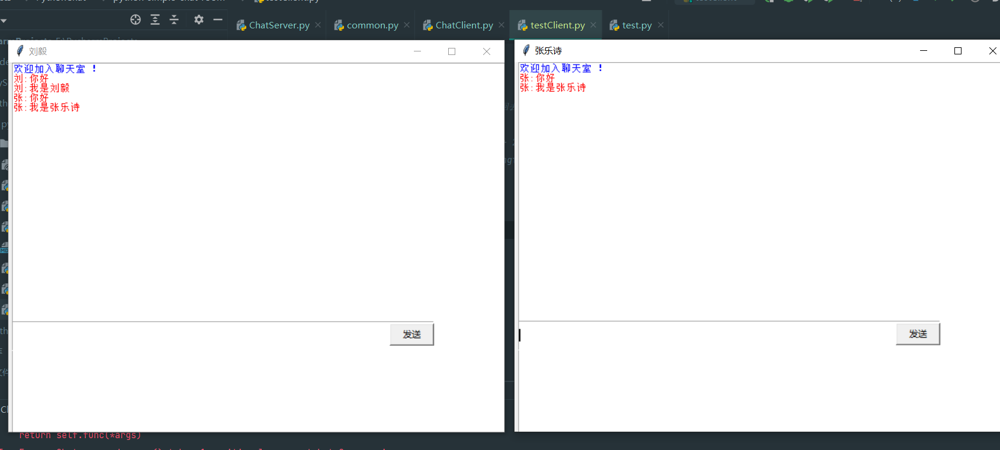
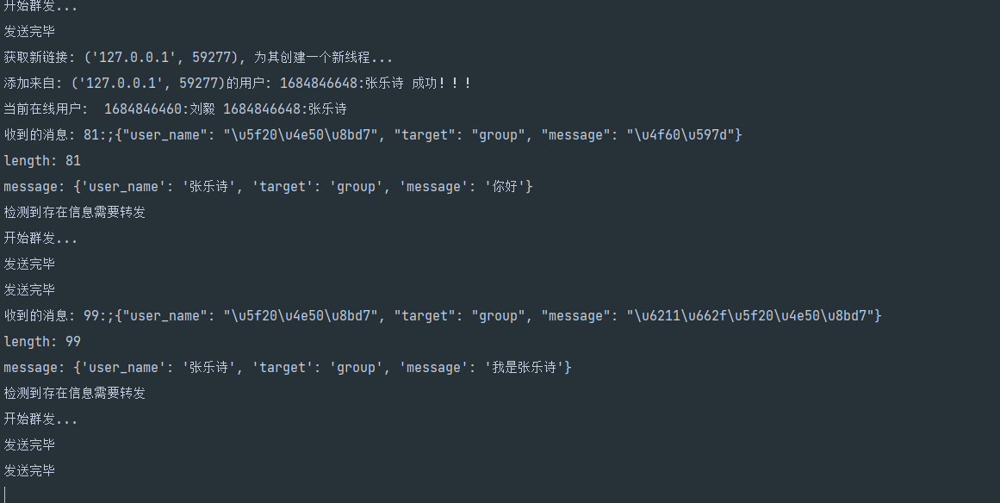

## 整体结构
项目采用 c/s 模式设计 <br>
服务端主要负责接收来自客户端的消息，并将其转发出去，每一个客户端对应一个线程<br>
客户端主要构建图形化界面，对用户发出的消息做格式化，以便服务端处理<br>
## 功能（暂定）
1. 能够提供基本的收发消息的功能
2. 提供基本的表情发送
3. 显示在线的用户
4. 提供私聊功能

## 服务端
1. 提供对`当前在线用户`的管理
2. 提供应用层正确获取数据的能力
3. 能够根据用户的需求，找到特定的发送对象，完成数据发送
### 定制应用层协议
length + ":;" + data   `e.g: 5:;hello` <br>
使用json完成序列化和反序列化


### 用户管理
```angular2html
class User:
    def __init__(self, sock, user_name, addr, id):
        self.sock = sock
        self.user_name = user_name
        self.addr = addr
        self.id = id


class Users:
    def __init__(self):
        self.user_group = []  # 存放 User列表
```
chatServer中只需要定义一个Users对象就可以实现对用户的管理

## 效果演示

后端日志打印效果：

